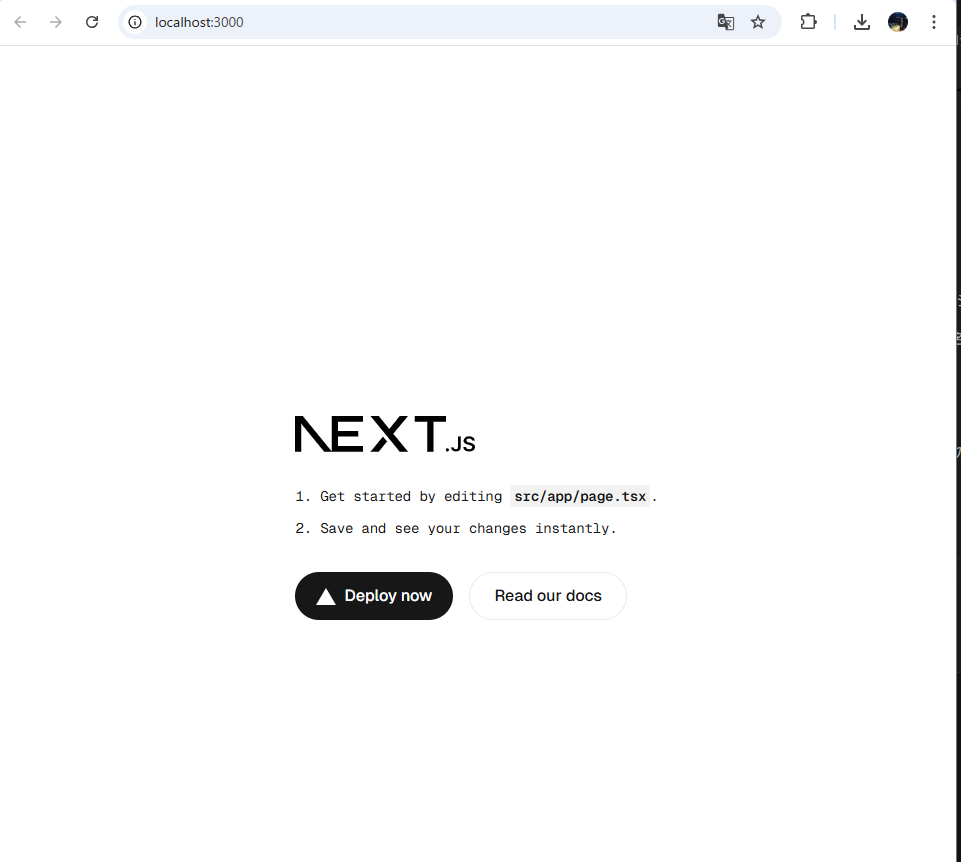
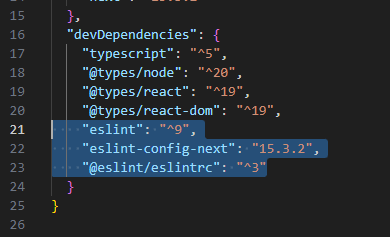
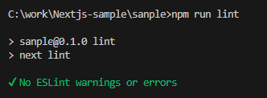
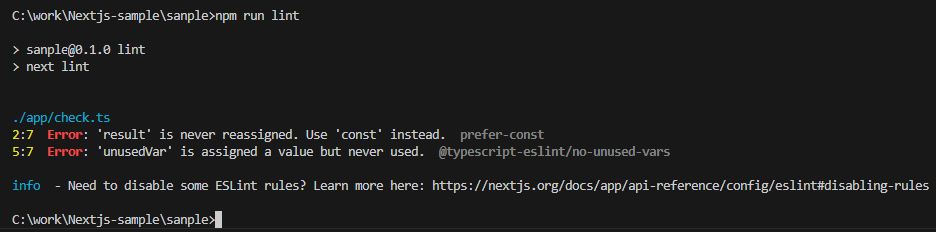
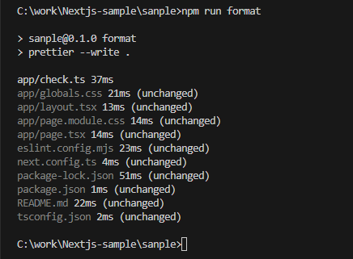
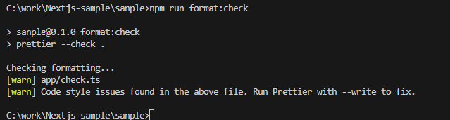
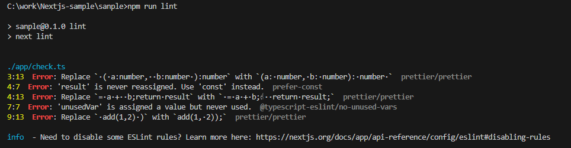

# Next.jsのお勉強

## 新規プロジェクトを立ち上げてみる

Node.jsのインストール  
https://nodejs.org/ja

インストールチェック  
```
node -v  
npm -v  
npx -v
```

プロジェクトを新規作成してみる

```
npx create-next-app@latest
```

下記が確認されて次へ  
・バージョンの確認（create-next-app使用の場合、バージョン指定は・ここではできず最新のものになる）  
・インストールしたNext.jsのプロジェクト（フォルダ）名の設定  
・TypeScriptを使用するか  
・ESLintを使用するか  
・Tailwindを使用するか  
・srcディレクトリを追加するか  
・Appディレクトリの機能を使用するか  
・外部ファイルを指定する際のプロジェクトディレクトリの扱いについてのもの  
※また今度詳細確認する


ローカル起動

```
npm run dev  
```



 

## ツールのインストール、設定、使用方法確認

### ESLint
構文ミスやコード品質の問題を検出し、一貫したコーディングスタイルを保つための静的解析ツール  

Next.jsではプロジェクト作成時に使用有無の確認でYesを選択することで自動で設定される

◆下記自動生成  
〇pakage.jsonでバージョンの管理確認ができる  
  
※正確なバージョンはpackage-lock.jsonに記載される  
※今回のインストールバージョンは9.27.0

〇実行スクリプト  
```
　"lint": "next lint"  
```
　→「npm run lint」で実行できる  
  
※エラーなし  


※エラーあり  


〇eslint.config.mjs  
　ESLint v9で推奨されている 新しい設定形式（flat config）  
　→export default に設定を記述  
　　・compat.extends(...) は、旧形式の extends を flat config に変換してくれる関数  
　　・"next/core-web-vitals"：Next.js推奨ルール＋Web Vitals監視ルールを含みます。  
　　・"next/typescript"：TypeScript対応のルール。
  


### Pritter  
コード整形（フォーマット）専用ツール  

〇インストール  
コマンド：npm install -D prettier eslint-config-prettier eslint-plugin-prettier  
　prettie：	Prettier 本体。コード整形を行うコアパッケージ。  
　eslint-config-prettier：ESLint のルールと Prettier の整形ルールが衝突しないように ESLint のフォーマット系ルールを 無効化する設定パッケージ。  
　eslint-plugin-prettier：Prettier の整形ルールを ESLint の prettier/prettier ルールとして組み込み、整形違反をESLintエラーに変換できるようにする。 ※Lintと統合するなら必要 

〇設定  
デフォルトの設定で十分なことが多い  
→prettier.config.jsのを作ってそこに詳細設定を書くことも可能  

※成形しないファイルは「.prettierignore」に設定できそう


〇動作  
・コードを自動整形する（修正を反映）  
```
npx prettier --write .
```


・フォーマットが正しいかチェックだけする  
```
npx prettier --check .
```


### ESLintとPritterの併用＋VSCode連携  
※eslint-plugin-prettier: ESLintの中でPrettierを動かして整形違反をエラーとして検出

〇ESLint と連携
eslint.config.mjsを修正・設定追加(↓例)  
```
import { FlatCompat } from "@eslint/eslintrc";
const compat = new FlatCompat({ baseDirectory: __dirname });

export default [
  ...compat.extends(
    "next/core-web-vitals",
    "next/typescript",
    "plugin:prettier/recommended" // これを追加
  ),
];


```
→Prettier のフォーマット違反を ESLint のエラーとして検出可能になる


〇VSCode連携  
.vscode/settings.json に下記を追加
```
{
  "editor.formatOnSave": true,
  "editor.defaultFormatter": "esbenp.prettier-vscode",
  "prettier.configPath": "./prettier.config.js",
  "eslint.validate": ["javascript", "typescript", "javascriptreact", "typescriptreact"],
  "eslint.run": "onSave"
}

```
・Prettier 拡張（esbenp.prettier-vscode）をインストール必須  
・保存時に自動で整形（Prettier）   
・保存時に ESLint チェック実行  


## React学習

1. Reactとは？  
UI（ユーザーイン1ターフェース）を作るためのJavaScriptライブラリ  
コンポーネント単位でUIを設計・再利用できる  
宣言的にUIを記述できる（状態やデータに応じて自動的に更新される）  

2. Reactコンポーネント（関数コンポーネント）の型付け
 ```
 import React from "react";

type GreetingProps = {
  name: string;  // 必須の文字列型プロパティ
};

const Greeting: React.FC<GreetingProps> = ({ name }) => {
  return <h1>Hello, {name}!</h1>;
};
 ```

・React.FC<Props> でpropsの型を指定  
・Propsはオブジェクトの型（必須・任意プロパティ指定可能）  

3. Propsの型定義例  
```
type ButtonProps = {
  label: string;
  onClick: () => void;  // 引数なし、戻り値なしの関数型
};

const Button: React.FC<ButtonProps> = ({ label, onClick }) => {
  return <button onClick={onClick}>{label}</button>;
};

```

4. Stateの型付け  
```
import React, { useState } from "react";

const Counter: React.FC = () => {
  const [count, setCount] = useState<number>(0);  // number型のstate

  return (
    <>
      <p>Count: {count}</p>
      <button onClick={() => setCount(count + 1)}>Increment</button>
    </>
  );
};

```
・useState<Type>(初期値)で状態の型を指定することができる  
・型推論で省略も可能（初期値から型を推論）  

5. イベントの型付け  
```
const handleClick = (e: React.MouseEvent<HTMLButtonElement>): void => {
  console.log("Clicked!", e.currentTarget);
};

<button onClick={handleClick}>Click me</button>;

```

・イベントハンドラの引数はReact.MouseEvent<TargetElement>やReact.FormEvent<TargetElement>などを使う  
・戻り値は通常void（何も返さない）  

6. リスト表示の型付け  
```
type User = {
  id: number;
  name: string;
};

type UserListProps = {
  users: User[];
};

const UserList: React.FC<UserListProps> = ({ users }) => (
  <ul>
    {users.map((user) => (
      <li key={user.id}>{user.name}</li>
    ))}
  </ul>
);

```

7. childrenの型  
```
type ContainerProps = {
  children: React.ReactNode;  // Reactの任意の子要素型
};

const Container: React.FC<ContainerProps> = ({ children }) => (
  <div className="container">{children}</div>
);
```

8. オプショナル（任意）props  
```
type MessageProps = {
  message?: string;  // 省略可能
};

const Message: React.FC<MessageProps> = ({ message }) => (
  <div>{message ?? "No message"}</div>
);
```

